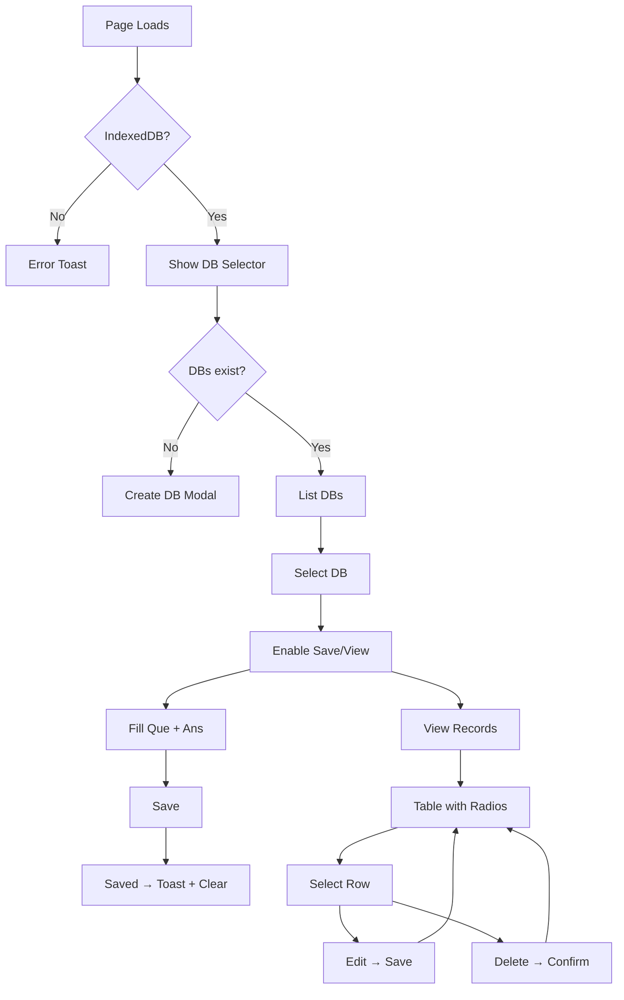

Below is a **ready-to-copy Markdown file** that contains the **complete “Full Process Flow & Features Analysis”** you asked for.  
Just save it as `ANALYSIS.md` (or any name you like) and push it to your GitHub repo.

```markdown
# Q&A / Alias Manager – Full Process Flow & Features Analysis

> **File:** `alias-manager.html`  
> **Author:** ChatGPT (original implementation)  
> **Date:** 2025-10-28  

---

## Overview

`alias-manager.html` is a **single-file, client-side web app** that lets users store **key/value alias pairs** (e.g., `prod_server_ip → 10.10.10.1:22`) in the browser using **IndexedDB**.  
It supports **multiple named databases**, full **CRUD** operations, and a polished UI – all without any server or external libraries.

---

## 1. Page Load & Initialization

```html
<body onload="init()">
```

* Checks `window.indexedDB` support.  
* Calls `DatabaseSelector.showSelectionModal(handleDbSelected)`.  
* Opens the **Database Selection Modal** automatically.

---

## 2. Database Management (Create / Select / Delete)

Implemented in the **`DatabaseSelector`** object.

| Action | Trigger | Result |
|--------|---------|--------|
| **Select** | “Use Selected Database” | `currentSelectedDB` set → `handleDbSelected()` → UI updates |
| **Create** | “Add New Database” → enter name → “Create and Use Database” | New IndexedDB created with object store `qa_items` (auto-increment `id`, index `queIndex`) |
| **Delete** | “Remove Selected Database” + confirmation | Entire DB removed via `indexedDB.deleteDatabase()` |

*Only databases containing the store `qa_items` are listed.*

---

## 3. Add / Update Alias (Main Form)

```html
<form id="qa-form">
  <input id="que">   <!-- Alias key -->
  <textarea id="ans"> <!-- Value -->
  <button id="save-button">Save / Update</button>
</form>
```

**Workflow**

1. Fill **Que** (must be unique – *soft enforcement*) and **Ans**.  
2. Click **Save / Update** → `saveOrUpdateRecord()`.  
3. `indexedDB.open(currentDBName)` → `put(record)`.  
4. Record receives:
   ```js
   {
     id: <auto-increment>,
     que: "...",
     ans: "...",
     status: "New Entry" | "Updated",
     timestamp: ISO string
   }
   ```
5. Success → toast + form cleared.

---

## 4. View All Records (Read)

Button **“View/Edit All Records History”** → `displayAllRecords()`.

* Opens modal `#records-display-modal`.  
* `store.getAll()` → sorted newest-first.  
* Table columns: **Sel. | ID | Que | Ans (truncated) | Status | Timestamp**.  
* Radio button per row → enables **Edit / Delete**.

---

## 5. Edit Record (Update via RUD)

*Select → “Edit Selected Record”* → `openEditRecordModal()`.

1. Loads record by `id`.  
2. Fills edit modal `#record-edit-modal`.  
3. Save → `put()` with `status: "MANUALLY EDITED (RUD)"`.  
4. Modal closes, table refreshes, toast shown.

---

## 6. Delete Record

*Select → “Delete Selected Record”* → confirmation → `store.delete(id)`.

* Table refreshed, toast: `Record ID X deleted.`

---

## 7. UI / UX Highlights

| Feature | Implementation |
|---------|----------------|
| **Toast messages** | `#message-box` (green/red, 3 s auto-hide) |
| **Form clear** | `clearForm()` |
| **Button states** | Save / View disabled until DB selected; Edit / Delete disabled until record selected |
| **Responsive layout** | Flexbox, max-width containers, mobile-friendly |
| **Modals** | Overlay, centered, close on backdrop click (via `hideModal`) |

---

## 8. Data Model (per record)

```js
{
  id:        Number,   // auto-increment primary key
  que:       String,   // alias key
  ans:       String,   // value / command
  status:    String,   // "New Entry" | "Updated" | "MANUALLY EDITED (RUD)"
  timestamp: ISO string
}
```

---

## 9. IndexedDB Schema

```
Database: <user-chosen-name>
└─ Object Store: qa_items
   ├─ keyPath: "id" (autoIncrement: true)
   └─ Index:   queIndex → field "que" (unique: false)
```

---

## Full User Workflow (Mermaid)



---

## Feature Checklist

| Feature | Status |
|---------|--------|
| Multiple named databases | Supported |
| Create DB | Supported |
| Delete DB | Supported |
| Add alias | Supported |
| Update (form) | Supported |
| Update (RUD edit) | Supported |
| View all records | Supported |
| Delete record | Supported |
| Timestamp & status tracking | Supported |
| Toast feedback | Supported |
| Fully offline / client-side | Supported |
| No external dependencies | Supported |

---

## Suggested Enhancements (optional)

* **Search / filter** in the records table.  
* **Export / Import** JSON of a database.  
* **Dark mode** toggle.  
* **Unique `que` enforcement** (`unique:true` index).  

---

**Enjoy the app!**  
Feel free to fork, star, or open issues on the repo.
```

---

### How to add it to GitHub

1. **Create a new file** in your repo called `ANALYSIS.md`.  
2. **Paste** the entire markdown block above.  
3. **Commit** → `Add analysis documentation`.  
4. Done! The file will render beautifully on GitHub.

Let me know if you’d like a **PDF** version, a **README** that links to this analysis, or any of the optional enhancements!
